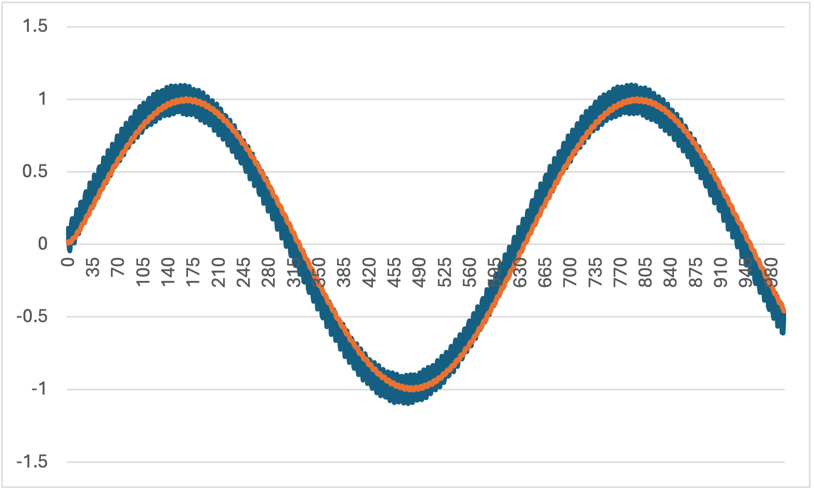

# ローパスフィルタのサンプルコード

## 実行方法
`example/filter/low_pass_filter`ディレクトリで以下のコマンドを実行し, 実行ファイルを作成する. 
```
gcc -o filter_program.out ../../../src/filter.c low_pass_filter.c -I ../../../src
```
実行ファイルができたので下のコマンドでプログラムを実行する
```
./filter_program.out
```
同じディレクトリ内に`low_pass_filter_output.csv`ファイルが出力される

## シミュレーション結果
`sin`波に, 適当にノイズを入れたものに平均値フィルタを通してみる
- 青: ノイズが入っている`sin`波
- 赤: フィルタを通した後の波形

ちょっとだけ時間遅れしてるかな

