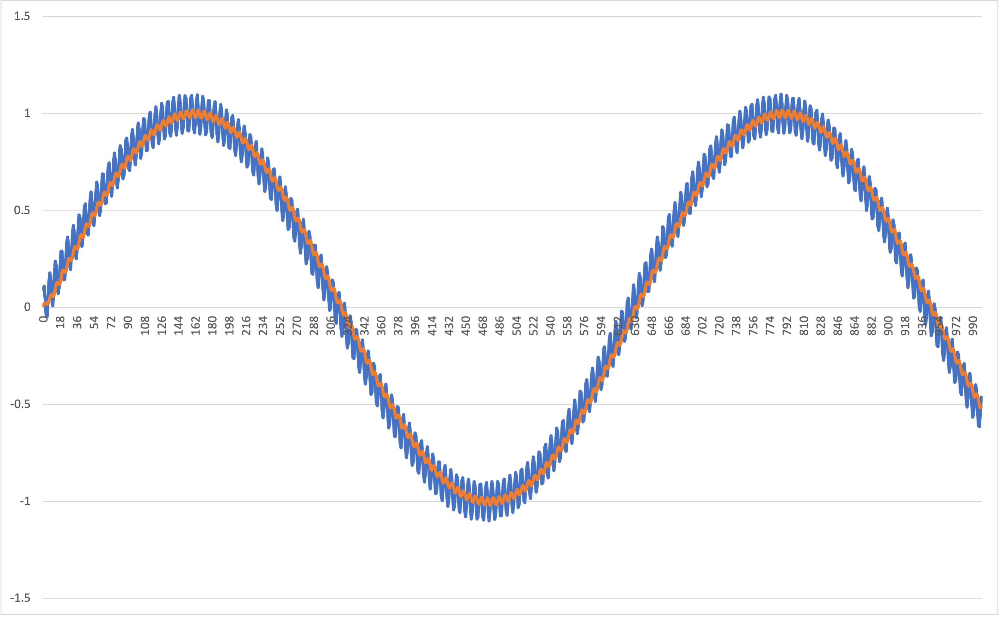

# 平均値フィルタのサンプルコード

## 実行方法
`example/filter`ディレクトリで以下のコマンドを実行し, 実行ファイルを作成する.
```
gcc -o filter_program.out ../../src/filter.c moving_average_filter.c -I ../../src
```
実行ファイルができたので下のコマンドでプログラムを実行する
```
./filter_program.out
```
同じディレクトリ内に`output.csv`ファイルが出力される.

## シュミレーション結果
`sin`波に, 適当にノイズを入れたものに平均値フィルタを通してみる
- 青: ノイズが入っている`sin` 波（フィルタを通す前）
- 赤: フィルタを通した後の波形

