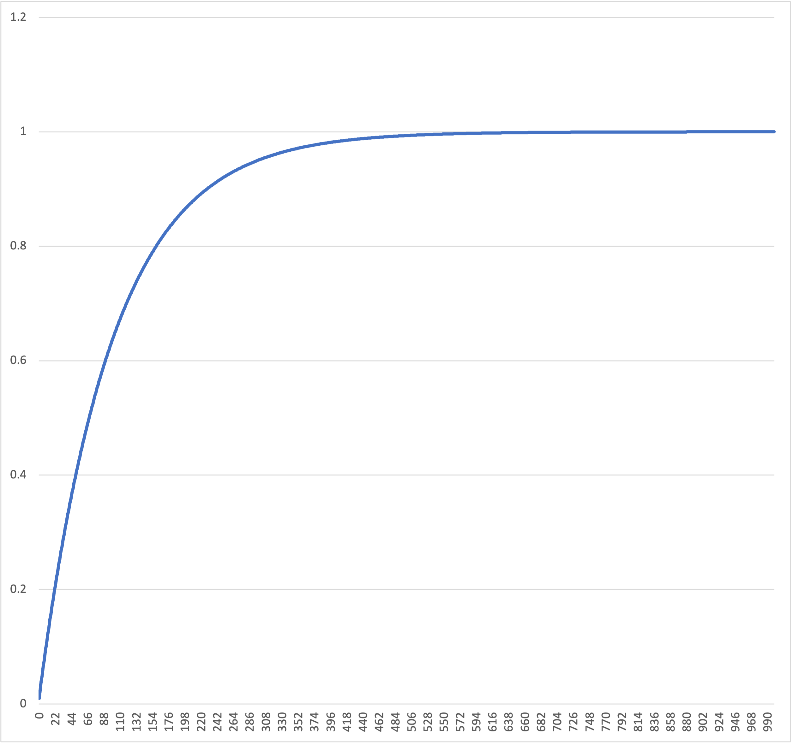
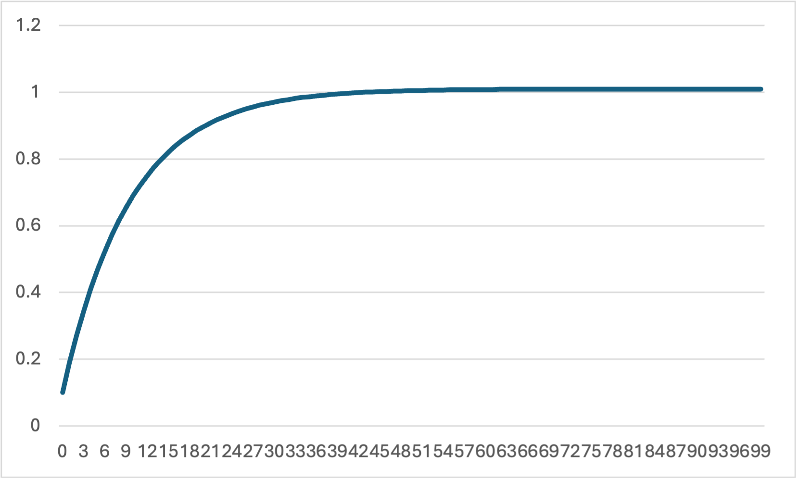

# サンプルコードの動かし方
プラントが積分器の場合の趣味レーション \

## PID
ビルド
```
gcc -o pid_program.out ../../src/pid.c pid.c -I ../../src
```
実行
```
./pid_program.out
```

`pid_output.csv`が出力されるのでグラフで表示させてみる.



## I-PD
ビルド
```
gcc -o i_pd_program.out ../../src/i_pd.c i_pd.c -I ../../src
```
実行
```
./i_pd_program.out  
```


`i-pd_output.csv`が出力されるのでグラフで表示させてみる.

